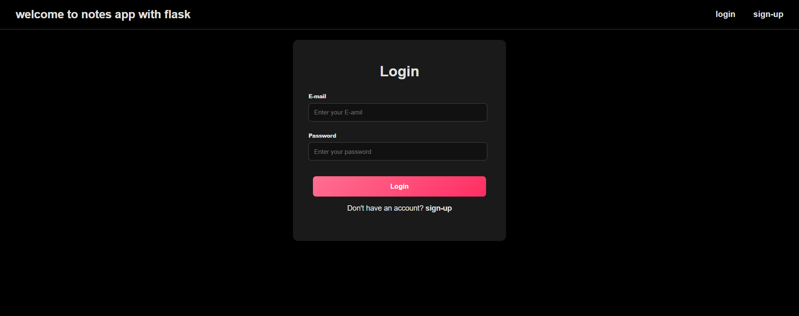
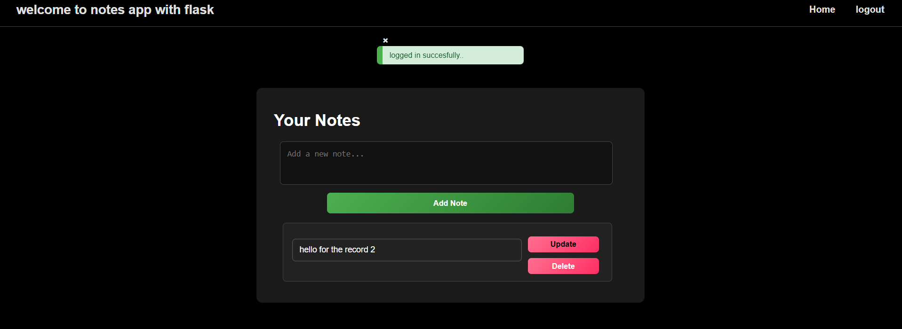

# 📝 Flask Notes App

A simple web application built with **Flask** that allows users to sign up, log in, and manage their personal notes.

---

## 🚀 Features
- good design with pure css and html
- User authentication (Sign Up / Login / Logout)
- Secure password hashing
- Add, update, and delete notes
- Flash messages for success & error handling
- Styled UI with custom CSS
- SQLite database support

---
## About the project 
### Login page 

### Sign-up Page 

### Home Page

